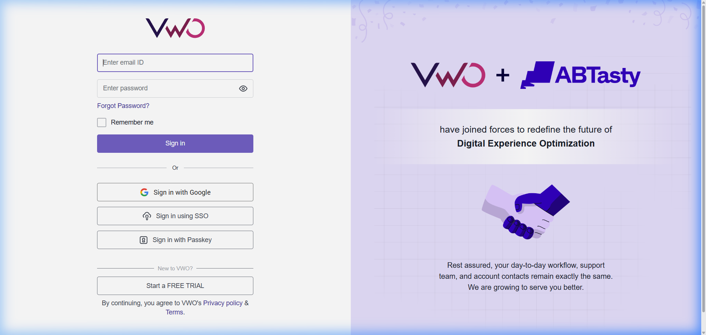
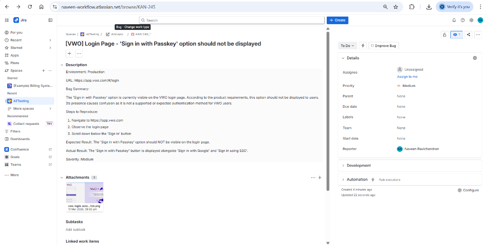

# MCP Basics — Playwright & JIRA Setup

This project configures two MCP (Model Context Protocol) servers for use with VS Code, Cursor, and Windsurf:

| Server | Package | Purpose |
|---|---|---|
| **Playwright** | `@playwright/mcp` | Browser automation & AI-driven testing |
| **JIRA** | `mcp-atlassian` | Jira Cloud issue management |

## Security & Configuration

The configuration in `.vscode/mcp.json` uses environment variables for security. Before running the JIRA MCP server, you must set these in your terminal or OS:

### Setting Environment Variables (Windows PowerShell)
```powershell
$env:JIRA_URL = "https://your-org.atlassian.net"
$env:JIRA_USERNAME = "your-email@example.com"
$env:JIRA_API_TOKEN = "your-jira-api-token"
```

### Setting Environment Variables (macOS/Linux)
```bash
export JIRA_URL="https://your-org.atlassian.net"
export JIRA_USERNAME="your-email@example.com"
export JIRA_API_TOKEN="your-jira-api-token"
```

---

## 1. Playwright MCP
Controls a browser using Playwright via accessibility tree snapshots.

## 2. JIRA MCP
Integrates with Jira Cloud for issue management.

---

## Project Showcase: Automated Bug Tracking

This project demonstrates a complete AI-driven QA workflow using MCP servers.

### 1. Automated Visual Testing (Playwright MCP)
The AI agent navigated to the VWO login page to perform a visual audit of the authentication interface.

**Target:** [https://app.vwo.com/#/login](https://app.vwo.com/#/login)
**Finding:** Identified an unexpected "Sign in with Passkey" option which was not part of the approved product requirement.



### 2. Automated Issue Logging (JIRA MCP)
Upon finding the discrepancy, a detailed bug was automatically logged in JIRA with full context, reproduction steps, and the evidence attached.

**Issue Created:** [KAN-245](https://naveen-workflow.atlassian.net/browse/KAN-245)
**Status:** Successfully Logged & Attached



---

## Detailed Reports
For more in-depth data, see the following reports:
- [**VWO Screenshot Test Report**](VWO_Screenshot_Test_using_MCP.md)
- [**JIRA Bug Report (KAN-245)**](JIRA_Bug_Report_using_MCP.md)

---

## Configuration File
The MCP servers are configured in `.vscode/mcp.json`.
